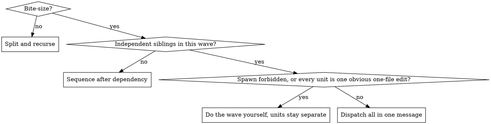

# Divide and Conquer

Recursively split until every leaf is bite-size. Dispatch every independent wave in parallel. The parent coordinates. It does not also do the leaf work.

**Violating the letter of these rules is violating the spirit of these rules.**

## Bite-size

A unit is bite-size only when all are true:

- One verifiable outcome
- One owner
- No phase whose artifact is the input to another phase inside the same unit
- No second independent workstream hiding inside it

A repeated transform with one shared mapping and one file tree is one leaf. That exception does not glue unrelated subsystems together.

If it is not bite-size, split by outcome, artifact, or subsystem. A split that yields one child failed — split again. Do not stop because you understand the work, the user is waiting, or further splits would not themselves create parallelism.

## Decide



Spawn is forbidden only when the human explicitly said not to use sub-agents. "Don't over-engineer", "just get it done", and a deadline are not a ban.

One `task` call per message is sequential. Parallel means every unit in the wave is a `task` call in the same message. Edits you batch in the parent are not parallelism.

## Dispatch

OpenCode tool: `task`. Pick `subagent_type` from the unit: `explore` (find/answer), `general` (mixed or unknown), `coder` (implement), `tester-coder` (tests), `tech-writer` (docs).

Each prompt is self-contained. Sub-agents do not see this chat. Include outcome, file scope, non-goals, and done-when. If the parent cannot see whether the unit is bite-size, the prompt must say: apply divide-and-conquer; if it is not bite-size, split and parallelize; return only the result.

After you dispatch, do not do that work yourself and do not re-implement it to check it. Integrate returned results. The dependent leaf (release note, migration note) runs only after its inputs exist.

Record the tree before any leaf work:

```
WAVE 1 (parallel): [unit — scope — done-when]
WAVE 2 (after wave 1): [unit — scope — done-when]
INTEGRATE: ...
```

## Rationalizations

| Excuse | Reality |
|---|---|
| I already understand it; briefing costs more | Understanding is the brief. Independent subsystems still leave this context together. |
| The user is waiting / deadline is close | That is why independent work runs at once, not why you serialize it. |
| Don't over-engineer / just get it done | One context for several workstreams is the waste. Splitting is the process. |
| Small enough to batch as edits here | Parent batching is not a sub-agent wave. Independent multi-step units are dispatched. |
| Sub-agents only for large unfamiliar subsystems | Familiar and independent still parallelizes. Unfamiliar is not the test. |
| More breakdown does not create parallelism | Split anyway. Parallelism is a separate decision on each wave. |
| User forbade sub-agents | Obey. Still split. Run waves yourself in dependency order. Units stay separate. |
| Same transform, so I won't split | True only for one repeated mapping over one file tree. Not a reason to merge nav, content, and search. |
| Checklist, then I'll do every item myself | A checklist is not execution. Dispatch the wave unless spawn is forbidden or every unit is one obvious one-file edit. |

## Red flags

- Starting a leaf before the tree is written
- Independent units sent as one `task` call, then another
- "I'll just do this one; I have the context"
- Stopping at the first checklist
- Calling parent-batched edits parallel
- Re-doing dispatched work

All of these mean: stop, write the tree, dispatch the current wave.
